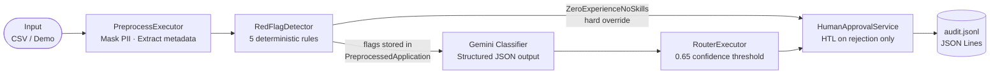

# AI Job Application Triage System

[](https://github.com/YaelAvramsky/ai-job-application-triage/actions/workflows/ci.yml)
[](https://dotnet.microsoft.com/en-us/download/dotnet/8.0)

A production-quality AI pipeline that triages job applications using Google Gemini for intelligent classification and deterministic C# rules for routing decisions. Built on Microsoft Agent Framework (MAF), it demonstrates structured LLM output, confidence-driven human escalation, an append-only audit log, and a clean separation between what the model proposes and what the code decides — all runnable with one Docker command.

---

## Quick Start

```bash
cp .env.example .env      # fill in your Gemini API key
touch audit.jsonl          # required for the Docker volume mount
docker compose up
```

---

## Architecture



**Pipeline steps:**

| Step | Component | Technology |
|---|---|---|
| 1 | PII masking, skill extraction | `PreprocessExecutor` — deterministic C# |
| 2 | Structural quality checks | `RedFlagDetector` — 5 regex/keyword rules |
| 3 | Intent classification | `GeminiClassificationAgent` — MAF + Gemini |
| 4 | Route decision | `RouterExecutor` — pure deterministic C# |
| 5 | Human-in-the-loop | `HumanApprovalService` — HITL on rejection path only |
| 6 | Audit trail | `AuditLogger` — append-only JSON Lines file |

---

## Tech Stack

| Concern | Technology |
|---|---|
| Language | C# 12 / .NET 8 |
| AI provider | Google Gemini 2.5 Flash via [GeminiDotnet](https://github.com/rabuckley/GeminiDotnet) |
| Agent framework | Microsoft Agent Framework (MAF) |
| Testing | xUnit 2.6 — 45 tests, no API key required |
| CI/CD | GitHub Actions |
| Containerisation | Docker multi-stage build + docker-compose |

---

## How to Run

### Docker (recommended)

```bash
cp .env.example .env   # add GEMINI_API_KEY=<your-key>
touch audit.jsonl       # create the file so Docker mounts it correctly
docker compose up
```

The container runs in demo mode by default. To use a different mode:

```bash
docker compose run triage --eval
docker compose run triage --input SampleData/example-input.csv
```

### dotnet CLI

```bash
# Set your API key via user-secrets (development) or environment variable
dotnet user-secrets set "Gemini:ApiKey" "your-key-here"
# or: export GEMINI__APIKEY=your-key-here   (double underscore = .NET config hierarchy)

dotnet run                                             # demo mode: 4 samples + eval suite
dotnet run -- --demo                                   # same as above (explicit)
dotnet run -- --eval                                   # evaluation suite only
dotnet run -- --input SampleData/example-input.csv    # batch-process a CSV file
```

### CSV input format

`--input` expects a mandatory header row followed by one application per line:

```
Id,ApplicantName,Email,Position,YearsOfExperience,Skills,CoverLetter
APP-001,Jane Smith,jane@example.com,C# Developer,7,C#;SQL;Azure,"Seven years building .NET microservices on Azure."
```

Skills are semicolon-separated (`C#;SQL;Azure`). The `CoverLetter` field may be quoted to include commas (RFC 4180). See [`SampleData/example-input.csv`](SampleData/example-input.csv) for a working example.

---

## How to Know It Works

### Unit tests — no API key required

```bash
dotnet test
```

45 tests across four classes — deterministic, in-process, sub-second:

| Class | Tests | What it covers |
|---|---|---|
| `RedFlagDetectorTests` | 13 | Each of the 5 rules fires on a crafted input; each is silent on a clean one |
| `RouterExecutorTests` | 9 | All routing paths, confidence boundary at exactly 0.65, red-flag override |
| `PreprocessExecutorTests` | 9 | Email masking (3 cases), required-skills detection (case-insensitive), cover-letter length |
| `GeminiSchemaBuilderTests` | 10 | Type mapping (STRING/NUMBER/INTEGER/ARRAY/enum), camelCase naming, `[SchemaIgnore]` exclusion |

### Evaluation suite — requires API key

```bash
dotnet run -- --eval
```

Runs 6 labeled test cases through the live Gemini classifier and reports pass/fail per case. This is the ground-truth check for the LLM component.

### Quality gates

| Gate | Command | Passes when |
|---|---|---|
| Build | `dotnet build` | Zero errors |
| Unit tests | `dotnet test` | All 45 green, no API key |
| Eval suite | `dotnet run -- --eval` | ≥ 5 / 6 cases correct |
| No secrets in repo | `git grep -i "apikey" -- "*.cs" "*.json"` | Zero hits |

---

## Engineering Decisions

**Schema-driven structured output.** `GeminiSchemaBuilder` reflects over `ClassificationResult` at startup and generates the Gemini `responseSchema` automatically. Adding or renaming a property updates the schema — there is no manually-maintained JSON definition that can drift out of sync.

**Classifier proposes, Router decides.** The LLM outputs a category and confidence score; a pure C# `RouterExecutor` applies the routing rules. This keeps all routing logic testable without an API key, makes the decision boundary explicit in code, and means the LLM can never directly trigger an action.

**Confidence threshold (0.65) for human escalation.** Any classification with confidence below 0.65 is routed to human review regardless of category. An uncertain model call should not trigger an automated accept or reject — uncertainty is a signal in itself.

**Human-in-the-loop only on rejection.** The HITL gate sits exclusively on the `Rejected` path. A false rejection damages the candidate experience more than a delayed approval slows the process, so human oversight is concentrated where the cost of error is highest.

**Deterministic red-flag rules run before the LLM.** `RedFlagDetector` checks five structural rules before any API call is made. Obvious problems (zero experience and no skills, copy-paste cover letters) are caught at zero API cost with full auditability. `ZeroExperienceNoSkills` hard-overrides the LLM decision; other flags are recorded for the audit trail.

**JSON Lines audit log.** Every triage decision appends one compact JSON line to `audit.jsonl`. JSON Lines is append-only (no framing to maintain on partial writes), trivially streamable, and greppable — the natural format for an audit trail.

---

## Example Output

<details>
<summary>Sample terminal session (demo mode)</summary>

```
info: ApplicationTriage[0] Mode: Demo

info: ApplicationTriage[0]
      ╔════════════════════════════════════════════════════════════════╗
      ║ PROCESSING: APP-001 (Alice Johnson)
      ╚════════════════════════════════════════════════════════════════╝
  [→ START] PREPROCESS: 14:23:01.441
  [✓ DONE ] PREPROCESS: 14:23:01.443
  [→ START] CLASSIFIER: 14:23:01.443
  [✓ DONE ] CLASSIFIER: 14:23:02.871
         {"ApplicationId":"APP-001","Category":"StrongCandidate","Priority":"High","MatchScore":0.92...
  [→ START] ROUTER: 14:23:02.872
  [✓ DONE ] ROUTER: 14:23:02.872
  [→ START] APPROVAL: 14:23:02.872
  [✓ DONE ] APPROVAL: 14:23:02.873
  [  RESULT] WORKFLOW: 14:23:02.873
         Approved: Application automatically approved. Proceeding to interview phase.
```

Corresponding line written to `audit.jsonl`:

```json
{"ApplicationId":"APP-001","Timestamp":"2025-01-15T14:23:02.873+00:00","Category":"StrongCandidate","Priority":"High","MatchScore":0.92,"Confidence":0.95,"Route":"AutoApprove","RedFlags":[],"Reasoning":"Candidate demonstrates strong C# and Azure expertise with 8 years of enterprise experience...","FinalStatus":"Approved"}
```

</details>

<details>
<summary>Red-flag override example (ZeroExperienceNoSkills)</summary>

When an application has zero years of experience and no skills listed, `RedFlagDetector` fires the `ZeroExperienceNoSkills` rule. The `RouterExecutor` overrides the LLM decision and forces `RequestMoreInfo` regardless of what the classifier returned:

```
warn: RouterExecutor[0]
      Red flag override for APP-003: ZeroExperienceNoSkills → forcing RequestMoreInfo (LLM decision ignored)
  [  RESULT] WORKFLOW: 14:23:05.102
         MoreInfoRequested: Additional information requested. Missing: ...
```

</details>

---

## Routing Reference

| Category | Priority | Confidence | Route |
|---|---|---|---|
| `StrongCandidate` | `High` | ≥ 0.65 | `AutoApprove` |
| `FitCandidate` | any | ≥ 0.65 | `PendingHumanReview` |
| `Incomplete` | any | ≥ 0.65 | `RequestMoreInfo` |
| `WeakCandidate` | any | ≥ 0.65 | `Rejected` + HITL |
| `StrongCandidate` | `Medium` / `Low` | ≥ 0.65 | `Rejected` + HITL |
| any | any | < 0.65 | `PendingHumanReview` |
| any (red flag: `ZeroExperienceNoSkills`) | — | — | `RequestMoreInfo` (override) |

---

## Known Limitations

- **Single position type.** Required skills (C#, SQL, Azure) and routing criteria are hardcoded for a C# developer role. Multi-role support would require configurable criteria sets per position.
- **Simulated human approval.** `HumanApprovalService` always returns `Approved = true` after a 100 ms delay. A real implementation would integrate with an email/Slack webhook or an approval queue.
- **Partial retry coverage.** The Gemini client retries HTTP 429 (rate-limit) errors. Other transient failures (500, 503) are not retried.
- **Eval suite costs money.** `dotnet run -- --eval` makes 6 live Gemini API calls. Results are non-deterministic. CI runs only the free xUnit tests.
- **Docker volume caveat.** Docker creates a directory instead of a file if `audit.jsonl` does not exist on the host before `docker compose up`. Run `touch audit.jsonl` first to ensure a correct file mount.

---

## What to Improve Next

- **Multi-role support** — configurable criteria sets loaded from JSON per position type
- **Gemini retry with exponential backoff** — cover 500/503 in addition to the existing 429 handling
- **Async human-approval** — real notification via email or Slack webhook; approval state persisted in a queue
- **Streaming CLI output** — live event display and progress indicators instead of batch logging
- **Scheduled CI eval job** — weekly Gemini run with `secrets.GEMINI_API_KEY` to detect LLM regression over time
- **`.dockerignore`** — exclude `bin/`, `obj/`, and `.vs/` from the Docker build context to speed up image builds
